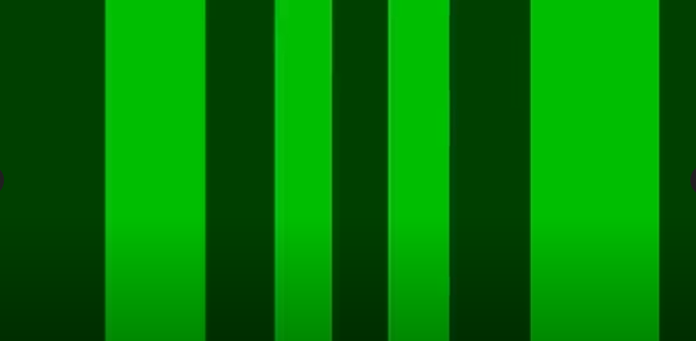

# Descriptions of Stimulus

An explanation of all existing stimulus in FlyFlix.

### Vertical Bars / Panels

The vertical bar or panel stimulus is the first type of stimulus in FlyFlix. It produces a strong, reliable behavioral response from drosophila. It consists of vertical bars moving horizontally across the screen. Each bar is actually a portion of a cylinder that surrounds the `camera`'s (or fly's) positions. An example of vertical bar stimulus can be seen below.

[Video of vertical bar stimulus](https://drive.google.com/file/d/1iTZ0GS-XrffRtWAVukqsXhvVacvsWQXm/view?usp=sharing)

### Starfield / Spheres

The starfield stimulus is a second type of stimulus in FlyFlix that also produces strong, reliable behavioral responses from drosophila.  It is currently only located in the starfield branch.